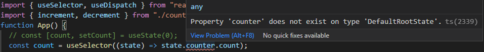
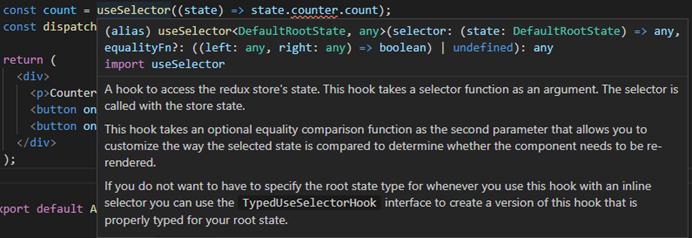

import image from "./images/react-redux-ts.png"

## Understanding React-Redux and typescript with migrating from React with hooks

This post is made for beginers from a typescript/redux beginner who just found out how the hell it works.

It is step-by-step guide for myself and other people who want to get a general introduction and use in future projects with a very simple example where from a react project we migrate bit by bit to a react-redux with typescript.

I am not using the new hooks from redux-toolkit which might be a better and simpler option but I wanted to start with a more common and simpler approach.

## What is the point of using redux?

The main advantage I see is that **you can change your states from any component without having to pass props** down all through the different levels. Then how you structure your components won’t affect how you manage the states.

For that you also could use the **React Context Api** but good practices says
that context should be just used for states that doesn’t change often for
example changing the theme from light to dark mode, or authentication.
For changing states which are changing more often it is more performant to use redux
because Context triggers a re-render on each update and redux not.

The good thing of redux is that there is not too much to understand as you can build your app the
same way as just react but you need to rebuild some parts with a defined
structure (**reducers**,**actions** and **store**) which is always the same.

## What is the worst of redux?

<li>You need to install different libraries.</li>

<li> It is not as lightweigth as context api.</li>

<li> It is very verbose. You need to set a whole boring file structure.</li>

**So only it is worth using redux when planning to make a complex app.**

## What is the point of using typescript?

Typescript is similar to javascript but we may need to define the **types** (Boolean, number, etc) of each variable, function and it’s return, etc. And the file extension changes from .js to **.ts** and from .jsx to **.tsx**.

## The simplest example, the Counter:

In your terminal:

```
npx create-react-app simple-counter
```

Change your `Index.js` to this. You can delete unnecessary files like css, logo, etc.:

```jsx
import React from "react"
import ReactDOM from "react-dom"

import App from "./App"

ReactDOM.render(
  <React.StrictMode>
    <App />
  </React.StrictMode>,
  document.getElementById("root")
)
```

Overwrite your `App.js`:

```jsx
import { useState } from "react"

function App() {
  const [count, setCount] = useState(0)

  function handleIncrement() {
    setCount(count + 1)
  }

  function handleDecrement() {
    setCount(count - 1)
  }

  return (
    <div>
      <p>Counter: {count}</p>
      <button onClick={handleIncrement}>Increment</button>
      <button onClick={handleDecrement}>Decrement</button>
    </div>
  )
}
export default App
```

## Let's introduce Redux:

In a big picture and super simplistic way we can say that in redux we devide our event handlers (or other stateful functions) like `handleIncrement` in two parts **Actions** and **Reducers**. Then combine everything in what we call **store** and use a **store provider** to have access to the states and change them from everywhere.

Here, Instead of changing the state there directly as usual inside our event handler as:

```jsx
setCount(count + 1)
```

Instead we need to divide this process in **two parts**:

<ol>
  <li>
    1. Define the eventhandler name and which arguments have (in this case we
    don’t pass arguments). This is what we call <b>'Action'</b> in redux. And we
    put in a actions file.
  </li>
  <li>
    2. Define how we change the state value when our eventhandler gets called,
    in a function called <b>'reducer'</b> (in this case would be the part where
    we do
    <b> count=count+1</b> or <b>count=count-1</b> depending on which eventhandler).
  </li>
</ol>

##

**In the terminal we install two packages to work with redux:**

```
npm install react-redux redux-devtools-extension
```

We change the **App.js** to this:

```jsx
// import { useState } from "react";
import { useSelector, useDispatch } from "react-redux";
import { increment, decrement } from "counter.actions";

function App() {
  // const [count, setCount] = useState(0);
 const count =useSelector(state=>state.counter.count)
 const dispatch=useDispatch();

  function handleIncrement() {
      dispatch(increment())
  }

  function handleDecrement() {
    dispatch(decrement())
  }

  return (
    <div>
      <p>Counter: {count}</p>
<button onClick={handleIncrement}>Increment</button>
      <button onClick={handleDecrement}>Decrement</button>
    </div>
  );
```

**useSelector** is like a useState for redux but we define in it’s argument which is the state we want to receive.

<blockquote display="warning">

Very important, note that the return we pass <b>'state=>state.counter.count'</b> NOT
'state=>state.count'.

</blockquote>

**counter** is whatever we call the reducer in our store later on. So if we decide
to call the reducer function as **counterfoo**: then we should write here: **state=>state.counterfoo.count**.{" "}

Basically the structure is like this: **state=>state.<'reducerName'>.<'stateName'>**.
That’s how we can access to different states of different reducers with useSelector.

##

**useDispatch** is the hook we use to get the dispatch function which we need to execute our actions which we imported from a file called actions.
Our actions **increment()**, **decrement()** will be defined in the following file:

Create a file called **counter.actions.js**:

```jsx
export const increment = () => ({
  type: "INCREMENT",
})

export const decrement = () => ({
  type: "DECREMENT",
})
```

And the reducer file called **counter.reducer.js**:

```jsx
export const countReducer = (state = { count: 0 }, action) => {
  switch (action.type) {
    case "INCREMENT": {
      return { ...state, count: state.count + 1 }
    }
    case "DECREMENT": {
      return { ...state, count: state.count - 1 }
    }
    default:
      return state
  }
}
```

Now create the store file **store.js**:

```jsx
import { combineReducers, createStore } from "redux"
import { countReducer } from "./counter.reducer"
import { composeWithDevTools } from "redux-devtools-extension"

const rootReducer = combineReducers({
  counter: countReducer,
  // second reducer ,
  // thirdreducer
})
export const store = createStore(rootReducer, composeWithDevTools())
```

Here we combine all our reducers, to pass a single **rootReducer** and **composeWithDevTools** as enhancer option to monitor all our states and actions with the redux devtools in our browser

To finish let’s wrap the app with the Store provider in your **index.js** so we can get our states and actions from any component without passing props down as we usually do in react:

```jsx
import React from "react"
import ReactDOM from "react-dom"
import App from "./App"
import { Provider } from "react-redux" //new code
import { store } from "./store" //new code

ReactDOM.render(
  <Provider store={store}>
    //new code
    <React.StrictMode>
      <App />
    </React.StrictMode>
  </Provider>, //new code
  document.getElementById("root")
)
```

## Now let's add Typescript:

First we will need to create configuration file called **tsconfig.json** in our root.

You can add this content inside by now:

```json
{
  "compilerOptions": {
    "target": "es5",
    "lib": ["dom", "dom.iterable", "esnext"],
    "allowJs": true,
    "skipLibCheck": true,
    "esModuleInterop": true,
    "allowSyntheticDefaultImports": true,
    "strict": true,
    "forceConsistentCasingInFileNames": true,
    "noFallthroughCasesInSwitch": true,
    "module": "esnext",
    "moduleResolution": "node",
    "resolveJsonModule": true,
    "isolatedModules": true,
    "noEmit": true,
    "jsx": "react-jsx"
  },
  "include": ["src"]
}
```

With this, we can start by changing file extension from **counter.actions.js** to **counter.actions.ts**.

```jsx
export const increment = () => ({
  type: "INCREMENT",
})

export const decrement = () => ({
  type: "DECREMENT",
})
```

Here we are setting the return of both functions as a string implicitly because we define type as :**”INCREMENT”** which is implicitly a string type.
So far there’s no need to add type but we will need to do it later.

We can check how if we run:

```
npm start
```

the app keeps working even some part is written in typescript.

<blockquote display="info">

So we can keep migrating to typescript as we go without having to migrate the whole app at once.

</blockquote>

In this case we are saying that the anonymous function () returns a customized type that we call **“Action”** which we define as an object with a property called **“type”** in which “type” is not related to any typescript type. **“type”** here is is the object property of the type of action (**“INCREMENT”** or **“DECREMENT”**) and we use to tell which action gets triggered. In this case type property has typescript type of string (**“DECREMENT”** or **“INCREMENT”**).

Confused? Just go on...you’ll see.

<blockquote display="info">

In typescript we are asked to define each variable and function return type unless it’s type it is implicit.

</blockquote>

Let’s go to our **counter.reducer.js** and we change to **counter.reducer.ts**:

```tsx
import { Action } from "./counter.actions"

type CountState = { count: number }
const initialState: CountState = { count: 0 }

export const countReducer = (state = initialState, action: Action) => {
  switch (action.type) {
    case "INCREMENT": {
      return { ...state, count: state.count + 1 }
    }
    case "DECREMENT": {
      return { ...state, count: state.count - 1 }
    }
    default:
      return state
  }
}
```

As we type the **“action”** agrument, typescript doesn’t know what type is action so our linter will ask us to define a type for action.

Then let’s go back to our **counter.actions.ts** and define it:

```tsx
export type Action = { type: string }

export const increment = (): Action => ({
  type: "INCREMENT",
})

export const decrement = (): Action => ({
  type: "DECREMENT",
})
```

Now we change **App.js** to **App.tsx**:

As we do this we get error beause counter in **state.counter.count** it is not defined.



We are getting a hint from our linter that something called **“DefaultRootState”** needs to be defined. And if we hover over the function useSeletor we can understand what **“DefaultRootState”** is in this context:



The good thing of typescript is that we get a lot of hints.
So we need to define a **RootState** which is in our store in **rootReducer**.
As rootReducer can be a complex changing object as we add more and more reducers we can use the **ReturnType<.typeof foo>** to know it’s type and export it to use it in our app.

In **store.js**:

```tsx
import { combineReducers, createStore } from "redux"
import { countReducer } from "./counter.reducer"
import { composeWithDevTools } from "redux-devtools-extension"

export type RootState = ReturnType<typeof rootReducer> //add this line

const rootReducer = combineReducers({
  counter: countReducer,
})

export const store = createStore(rootReducer, composeWithDevTools())
```

Now in our **app.js** we add types to our useSelector like this:

```tsx
const count = useSelector<RootState, any>(state => state.counter.count)
```

First argument between brackets is our argument, and second our return.

This will work but the point of typescript is to define as much possible all types of the function and it’s returns. “any” is ambiguos so we could define “number” instead but even a better option is to relate this type to the state atribute which we defined in the reducer where we said

```tsx
type CountState = { count: number }
```

So let’s export theCountState type in our final **counter.reducer.ts**:

```tsx
import { Action } from "./counter.actions"

export type CountState = { count: number } //add export
const initialState: CountState = { count: 0 }

export const countReducer = (state = initialState, action: Action) => {
  switch (action.type) {
    case "INCREMENT": {
      return { ...state, count: state.count + 1 }
    }
    case "DECREMENT": {
      return { ...state, count: state.count - 1 }
    }
    default:
      return state
  }
}
```

And import it in our final **App.tsx**:

```tsx
// import { useState } from "react";
import { useSelector, useDispatch } from "react-redux"
import { increment, decrement } from "./counter.actions"
import { RootState } from "./store"
import { CountState } from "./counter.reducer"
function App() {
  // const [count, setCount] = useState(0);
  const count = useSelector<RootState, CountState["count"]>(
    state => state.counter.count
  )
  const dispatch = useDispatch()

  function handleIncrement() {
    dispatch(increment())
  }

  function handleDecrement() {
    dispatch(decrement())
  }

  return (
    <div>
      <p>Counter: {count}</p>
      <button onClick={handleIncrement}>Increment</button>
      <button onClick={handleDecrement}>Decrement</button>
    </div>
  )
}

export default App
```

Note that we do not set the return type as simply **CountState**, we set is as **CountState[‘count’]** because we want to get the type of the atribute count which is inside the CountState type which corresponds to:

```tsx
count: number
```

One more thing is that it could be a good practice to give a type to our functional components.
Typescript would not complain in this case if you leave it without typing but in general it is better to do it for error spotting.

```tsx
function App(): React.ReactElement {
```

Remember to **import React from "react"** on top.

It is also very common to type components as:

```tsx
const App: React.FC = () => {
```

Now let’s change our **index.js** to **index.tsx**.

If we just change to **index.ts** we will get errors. As we are using components, typescript would complain if extension is not **.tsx**.

Then when we run the app we find that there are missing types declaration for the module **“react-dom”**. It happens often that we install modules but the types are not installed so in this case we just need to install through our terminal:

```
npm i --save-dev @types/react-dom

```

We can check how our actions and changes of state installing a redux extension for our browser for exemple this is for [Google Chrome](https://chrome.google.com/webstore/detail/redux-devtools/lmhkpmbekcpmknklioeibfkpmmfibljd).

If you want to check more simple examples on how to use diferent reducers, actions with payload, pass props and use redux in async funcions like API requests. You can check in my repo [here](https://github.com/Mgot12602/counter-with-notes-redux-typescript)

Thanks for reading and hope it was helpful!
